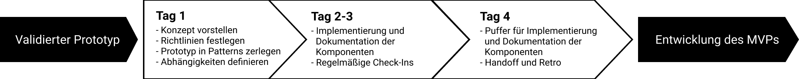
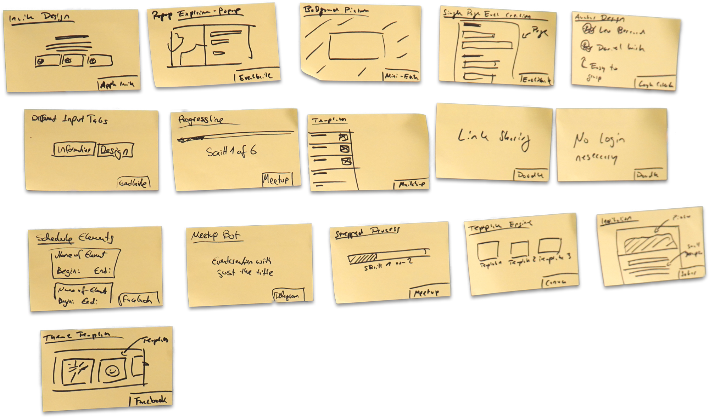
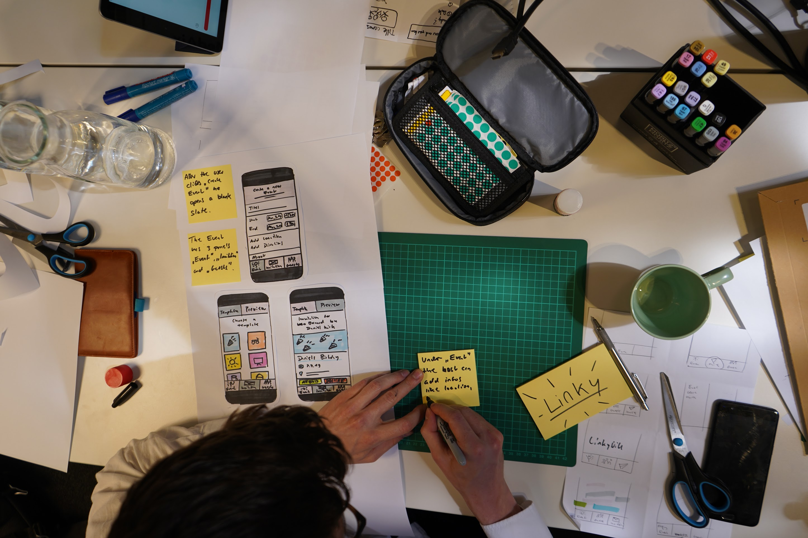
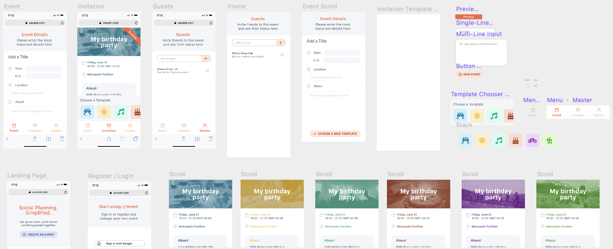
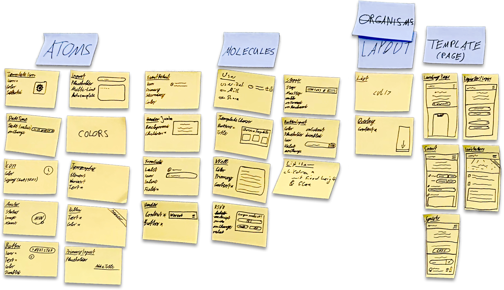

# Disclaimer

In dieser Arbeit wird aus Gründen der besseren Lesbarkeit teilweise das generische Maskulinum verwendet. Weibliche und anderweitige Geschlechteridentitäten sind dabei ausdrücklich mitgemeint, soweit es für die Aussage erforderlich ist.

Bei Zitaten ohne Angabe einer absoluten Seitenzahl handelt es sich um Webseiten oder E-Books, deren Seitenzahlen von der Bildschirmgröße abhängig sind. Bei diesen Quellen werden alternativ Kapitel- und Abschnittsangaben verwendet.

Die Arbeit sowie alle im Rahmen der Arbeit entstandenen Ergebnisse sind open-source und können online[^1] eingesehen werden.

# Einleitung

# Motivation / Zielsetzung

Ziel dieser Bachelorarbeit ist es, ein Konzept für einen Sprint zu entwickeln, der den Übergang vom Prototypen aus einem Design Sprint zum fertigen Minimum Viable Product optimal überbrückt.

# Begründung

Design Sprints wurden 2012 von Jake Knapp entwickelt [@knapp2016, S. 5] und werden dazu eingesetzt, innerhalb von einer Woche eine Produktidee zu einem Prototypen auszuarbeiten und an echten Nutzern zu testen. Design Sprints können für jede Art von Produkten – physisch und digital – eingesetzt werden. In dieser Arbeit konzentriere ich mich jedoch auf den Einsatz von Design Sprints im Softwarebereich, also z.B. für Apps und Websites.

Nach einem erfolgreichen Design Sprint entwickeln Firmen meist auf Basis des dort entwickelten Prototypen ein Minimum Viable Product, oder auch MVP, das sie auf den Markt bringen können.

Der in dieser Bachelorarbeit ausgearbeitete Sprint, den ich Component Sprint nenne, soll Entwicklern die Entwicklung des MVP vereinfachen, indem sie bereits alle nötigen UI-Komponenten in Form einer Pattern Library zur Verfügung gestellt bekommen. So können sie sich bei der Entwicklung des MVP mehr auf die Implementierung der Logik konzentrieren.

# Vorgehen

Um das Konzept für Component Sprints zu entwickeln, werde ich zuerst bestehende Grundlagen erörtern und relevante Konzepte und Frameworks vorstellen. 

Basierend auf diesen Frameworks werde ich die erste Version des Component Sprints entwickeln. Darauf folgend werde ich einen empirischen Test des entwickelten Konzepts in Form eines Design Sprints mit anschließendem Component Sprint durchführen und die Ergebnisse sowie Erkenntnisse zusammenfassen.

Um das Konzept weiter zu verfeinern werde ich eine qualitative Studie in Form von drei Interviews mit Personen aus relevanten Bereichen durchführen, in denen ich das Konzept sowie bestehende Ergebnisse vorstelle und weitere Meinungen einhole.

Letztlich werde ich Schritte zur Weiterentwicklung des Konzepts anreißen und darlegen, wie sich Component Sprints in Zukunft ausbauen lassen können.

# Theoretische Grundlagen / Einordnung
## Prozess der Produktentwicklung
In den letzten 20 Jahren hat sich der Prozess, in dem Software entwickelt und veröffentlicht/verbreitet wird, stark verändert. Vor 20 Jahren wurde Software hauptsächlich als CD verkauft. Ein normaler Release-Zyklus lag bei mehreren Monaten. Bugs in der Software konnten erst in der nächsten Version behoben werden, Feedback von Benutzern konnte erst Monate später umgesetzt werden.

Durch die Verbreitung des Internets wurde es einfacher, neue Versionen regelmäßiger zu veröffentlichen. Es ist heutzutage normal, dass Software täglich neue Updates bekommt. Analytics Tools wie Google Analytics und Mixpanel ermöglichen es Firmen, genaue Insights zum Benutzerverhalten in ihrer Software zu erlangen. So können potentielle Problemstellen in Programmen genauer identifiziert und behoben werden.

In den folgenden Kapiteln werde ich mich auf die heutige Entwicklung von Apps und Websites konzentrieren.

## Auswahl relevanter Konzepte und Frameworks
## Design Sprints

Ein normaler Zyklus in der heutigen Entwicklung von Apps und Websites kann in vier Schritte unterteilt werden:

- **Ideate:** Generierung und Ausarbeitung von Ideen
- **Build:** Umsetzung der Ideen in Software
- **Launch:** Veröffentlichung der Software auf dem Markt
- **Data:** Sammeln von Insights und User Feedback

![Klassischer Entwicklungszyklus nach Jake Knapp \[@knapp2018, S. 65\]](assets/DraggedImage.png) 

Bei der Entwicklung von Apps ist es normalerweise notwendig, diesen Zyklus mehrere Male zu durchlaufen, um eine optimale Version zu erhalten. Dabei ist vor allem der Build-Schritt zeitaufwändig. Wenn der Launch nicht erfolgreich ist, wurden diese Ressourcen verschwendet.

![Design Sprint Zyklus \[@googleventures\]](assets/Design%20Sprint%20Cycle.jpg)

Der Design Sprint ist ein Ansatz, der diesen Zyklus optimiert. Hierbei werden die Build- und Launch-Schritte durch Prototyping und User Testing ersetzt, sodass User Feedback schneller gesammelt werden kann.

![Struktur des gesamten Design Sprints \[@knapp2016, S. 17\]](assets/Design%20Sprint%20Structure.jpg)

Ein Design Sprint dauert in der Regel fünf Tage – Montag bis Freitag – und wird vor Ort mit einem interdisziplinären Team von 4-7 Personen und einem Moderator durchgeführt.  Die Tage sind zeitlich fest strukturiert und jegliche Form von Ablenkung, wie z.B. Handys oder Laptops, ist nicht erlaubt. Ziel dieser Maßnahmen ist es, dass sich das Team fokussiert mit den Aufgaben auseinandersetzen kann [@knapp2016, S. 41]. Gesammelte Informationen werden auf Post-its festgehalten, sodass sie für jedes Teammitglied jederzeit sichtbar sind [@knapp2016, p. 20].

Generell wird in Design Sprints auf lange Diskussionen verzichtet. Diese sind nicht effizient und geben Teilnehmern mit einer starken Meinung zu viel Gewichtung und Einfluss auf die Entscheidungen [@kahneman2013, K. 7]. Stattdessen werden Entscheidungen per Abstimmung, meist mit Hilfe von Klebepunkten, getroffen. Der CEO, Gründer, Produktmanager oder Head of Design hat als Decider in Abstimmungen eine größere Entscheidungskraft [@knapp2016, S. 34].

Am Montag wird die Problemstellung definiert. Vormittags definiert das Team nach einer kurzen Einführung das Langzeitziel des Projektes und Fragen, die für den Sprint interessant sein könnten. Darauf folgend wird eine Abbildung der erwarteten Customer Journey angelegt [@knapp2016, S. 65].

Nachmittags werden sogenannte Experteninterviews durchgeführt. Ziel dieser Interviews ist das Sammeln und Festhalten von Wissen, das häufig auf einzelne Teammitglieder verteilt ist [@knapp2016, S. 68]. Während der Interviews legen alle Mitglieder in Stille Notizen auf Post-its in Form von “How Might We”- (oder auf Deutsch “Wie können wir”)-Fragen an. Eine Frage kann beispielsweise lauten: “Wie können wir das User-Onboarding vereinfachen?” oder “Wie können wir unser Produkt freundlich wirken lassen?”. Diese Fragen werden daraufhin an einer Wand sortiert, per Abstimmung priorisiert und die wichtigsten in die Customer Journey eingeordnet [@knapp2016, S. 80-88].

Am Dienstag sucht das Team online nach Konzepten, Komponenten und anderen Beispielen, die im Kontext der am Montag definierten Fragen und Ziele relevant sein könnten und präsentiert diese kurz. Für jede Komponente wird ein Post-it erstellt [@knapp2016, S. 98-100].

![Struktur des Dienstages \[@knapp2016, S. 109\]](assets/DraggedImage-1.png)

Basierend auf diesen Ideen werden nun von allen Teammitgliedern Skizzen und Notizen angelegt. Diese werden über weitere Übungen zu einem Solution Sketch pro Person ausgearbeitet. Diese Sketches bilden in maximal 3 Schritten detailliert die Interaktion der Nutzer mit dem Produkt ab und bleiben den anderen Teammitgliedern gegenüber bis zum nächsten Tag versteckt [@knapp2016, S. 114-118].

Am Mittwoch entscheidet sich das Team für den besten Solution Sketch. Diese Entscheidung wird in 5 Schritten durchgeführt: Art museum, Heat map, Speed critique, Straw poll und Supervote [@knapp2016, S. 131].

Im ersten Schritt werden die Solution Sketches, die am Vortag erstellt wurden, aufgedeckt und nebeneinander aufgehangen. Die Sketches sind anonym, um eventuellen persönlichen Einflüssen entgegenzuwirken [@knapp2016, S. 132].

Darauf folgend markiert jedes Teammitglied auf jedem Solution Sketch mit Klebepunkten interessante Konzepte und Ideen. Fragen und Anmerkungen können per Post-it hinzugefügt werden. Dieser Schritt wird in Stille durchgeführt und gibt dem Team einen guten Überblick über interessante Bereiche in den Sketches [@knapp2016, S. 132-135].

Im dritten Schritt wird jeder Solution Sketch drei Minuten lang besprochen. Die Besprechung folgt einer festen Struktur, damit sie konstruktiv bleibt und sich das Team nicht in Details verliert. Die Ergebnisse der Besprechungen werden auf Post-its über den Solution Sketches aufgehangen [@knapp2016, S. 135-137].

Im vierten Schritt stimmt jedes Teammitglied für den Solution Sketch, den er am besten findet, ab und erklärt seine Entscheidung in einem ein-minütigen Vortrag.  [@knapp2016, S. 138-140]. 

Im letzten Schritt entscheidet sich der Decider für seine Favoriten, basierend auf den Abstimmungsergebnissen der anderen Teammitglieder, den Sprintfragen und dem festgelegten Langzeitziel. Diese Entscheidung ist absolut und die Grundlage für das folgende Prototyping [@knapp2016, S. 140-142]. Wenn mehr als ein Favorit ausgewählt wurde, wird gemeinsam entschieden, ob alle favorisierten Solution Sketches in einen Prototyp übernommen werden oder ob mehrere Prototypen erstellt werden sollen [@knapp2016, S. 145].

Am Mittwoch Nachmittag wird basierend auf den gewählten Solution Sketches ein oder mehrere Storyboards auf einem Whiteboard erstellt. Dies geschieht im Team, wobei der Decider auch hier das letzte Wort hat. Das Storyboard dient als Grundlage für den Prototypen und sollte so detailliert sein, dass der User Flow klar ist [@knapp2016, S. 148-156]. Knapp betont in diesem Schritt das Mantra “When in doubt, take risks.”: Der Design Sprint ist eine gute Möglichkeit, riskantere Entscheidungen zu testen.

Der Donnerstag ist dem Prototyping gewidmet. Hier wird auf Basis des erstellten Storyboards ein Klick-Dummy, bzw. Throwaway Prototype erstellt. Dieser Prototyp soll sich für Testnutzer am Freitag echt anfühlen, muss aber nur die Funktionalität abbilden, die am Freitag wirklich getestet wird. Umso mehr sich der Prototyp wie ein echtes Produkt anfühlt, desto mehr werden die Testnutzer authentisch reagieren [@knapp2016, S. 168-170].

Das Prototyping geschieht in Teamarbeit. So erstellen beispielsweise zwei Personen einzelne Komponenten oder Screens und eine Person kombiniert diese zu einem einheitlichen Prototypen. Zusätzlich dazu ist eine Person für das Schreiben von Texten und eine oder mehr Personen für das Sammeln von Assets wie Bilder und Icons verantwortlich [@knapp2016, S. 171].

Die Person, die am nächsten Tag die Interviews mit Testnutzern durchführen wird, konzipiert währenddessen ein Skript mit dem die Nutzer durch den Prototypen geführt werden [@knapp2016, S. 171].

Am Freitag wird der Prototyp an fünf Nutzern getestet. Nach einer kurzen Einleitung und generellen Fragen zum Nutzer wir dieser durch den Prototypen geführt.  Der Interviewer versichert den Nutzern dabei, dass nicht sie, sondern das Produkt, getestet werden. Sie können daher nichts falsch machen und es ist in Ordnung, wenn sie eine Aufgabe nicht verstehen oder ausführen können.

![Aufbau der Interviews \[@knapp2016, S. 174\]](assets/DraggedImage-2.png)

Interviewer und Testnutzer sitzen beim Interview zu zweit in einem Raum. Das Gespräch wird per Video an den Rest des Sprint-Teams übertragen, der in einem anderen Raum sitzt. Diese Personen machen sich während des Interviews in stiller Einzelarbeit auf Post-its Notizen zu dem Feedback des Testnutzers [@knapp2016].

Nach den Interviews werden die Notizen sortiert und gruppiert, sodass sich daraus Schlüsse über das weitere Vorgehen schließen lassen können. Im Team wird nun mit Blick auf die am Montag definierten Sprintfragen und Langzeitziele über das weitere Vorgehen diskutiert. Der Decider hat auch hier das letzte Wort.

Design Sprints werden von vielen Unternehmen nicht 100% so durchgeführt wie es in dem Buch *Sprint* [@knapp2016] vorgeschlagen wird. Die Design Sprint Agentur AJ&Smart[^2] bietet beispielsweise einen Design Sprint in vier Tagen unter dem Namen “Design Sprint 2.0” an. Hier werden die ersten beiden Sprinttage in einen Tag zusammengeführt und die Übungen so angepasst, dass sie in der kürzeren Zeit durchgeführt werden können. So werden beispielsweise einzelne Experteninterviews in ein Gruppeninterview zusammengeführt, das auf 30 Minuten beschränkt ist [@smart2018].

Bei Crisp Studio, einer Design Sprint Agentur aus Aachen[^3], orientieren wir uns am viertägigen Sprint von AJ&Smart. Dazu tauschen wir die Reihenfolge einiger Übungen, da sie so aus unserer Sicht mehr Sinn ergeben. Wir legen beispielsweise die Sprintfragen an den Anfang des ersten Sprinttages, sodass alle Teammitglieder bei den Sprintfragen und dem Langzeitziel bereits auf dem gleichen Stand sind. Zusätzlich enthalten unsere Sprints neue Übungen, wie z.B. Note-n-Map [siehe @cruchon2019], die den Prozess weiter vereinfachen. In unseren Design Sprints sind nicht alle Teammitglieder an allen vier Tagen anwesend. Die Teammitglieder des Kunden sind hier nur an den ersten beiden Tagen anwesend. Dies vereinfacht die Organisation des Sprints erheblich, da unsere Kunden sich nicht eine ganze Woche freihalten müssen. Das Prototyping und Testing wird von der Agentur übernommen [@nauheimer2019].

## Prototyping

Prototypen sind in ihrer Grundform im Duden als “[…] zur Erprobung und Weiterentwicklung bestimmte erste Ausführung […]“ definiert. Das Wort stammt vom Griechischen “prōtótypos”, übersetzt “ursprünglich”, ab [@dudenPrototyp]. Prototypen dazu eingesetzt, Ideen mit minimalem Aufwand zu testen. Prototyping bezeichnet die Erstellung eines Prototypen.

![Kategorisierung der Arten von Prototyping \[@verner, S. 7\]](assets/DraggedImage-3.png)

Im Kontext der Softwareentwicklung lässt sich Prototyping grob in drei Kategorien einteilen: Experimentelles, erforschendes und evolutionäres Prototyping [@verner, S. 7]. Diese Einteilung ist nicht absolut und die Begriffe variieren zwischen Quellen. So kann beispielsweise dem evolutionären Prototyping auch das Rapid Application Development (RAD) zugeordnet werden, das als Begriff erstmals 1988 von Barry Boehm [@boehm1988] im Kontext seines Spiral Models vorgestellt wurde. Dieser Begriff wurde jedoch auch durch das 1991 von James Martin vorgestellte Modell [@martin1991] geprägt, welches sich im Ansatz von Boehms Modell unterscheidet. 

Der Prototyping-Schritt in Design Sprints ist ein Rapid Throwaway Prototyping oder kurz Throwaway Prototyping, das sich dem erforschenden Prototyping unterordnen lässt. Bei diesem Ansatz werden Prototypen mit Fokus auf Geschwindigkeit entwickelt. Die Qualität des Programmcodes und die Sorgfältigkeit der Entwicklung sind dabei nicht wichtig, da der Prototyp nach der Evaluation nicht weiterentwickelt, sondern verworfen wird [@crinnion1992, S. 18]. 

![\[@knapp2016\]](assets/DraggedImage-4.png)

Durch die Geschwindigkeit der Entwicklung fällt es dem Team meist leichter, Ideen zu verwerfen, da es so noch nicht zu viel Zeit in die Entwicklung dieser investiert hat [@knapp2016]. 

## Minimum Viable Products

Ein Minimum Viable Product, kurz MVP, auf Deutsch “minimal überlebensfähiges Produkt“ [@wikiMVP], ist laut Eric Ries ein Produkt, das dem Entwicklerteam mit dem geringsten Aufwand die maximale Menge an validiertem Wissen über seine Kunden bietet [@ries2009].

MVPs werden eingesetzt um zu erforschen, wie der Zielmarkt auf ein potentielles Produkt oder ein neues Feature bei bestehenden Produkten reagieren würde. So wird das Risiko minimiert, Zeit in ein die Entwicklung eines Produktes oder Features zu investieren, das letztendlich nicht genutzt wird und sich nicht verkaufen lässt.

Die Definition von “Minimum” im Kontext des MVP ist laut Ries nicht festgelegt. So kann der Entwicklungsaufwand je nach Produkt zwischen wenigen Tagen und mehreren Monaten liegen [@ries2009].

Ähnlich wie im Fall des Begriffs “Prototyping” gibt es auch für das MVP verschiedene Definitionen. Der Begriff wurde erstmals 2001 von Frank Robinson als “[…] unique product that maximizes return on risk for both the vendor and the customer” [^4] [@robinson2001] definiert. Steve Blank definierte MVPs 2010 als “[…] Customer Development tactic to reduce engineering waste and to get product in the hands of Earlyvangelists soonest” [^5] [@blank2010].

Ries’ Definition hat aktuell jedoch die größte Reichweite. Die meisten Definitionen bauen entweder auf seiner Definition oder auf der Definition von Steve Blank auf [@lenarduzzi2016, S. 119].

## Atomic Design

Atomic Design ist ein System zur hierarchischen Organisation und Strukturierung von UI Komponenten, das erstmals 2013 von Brad Frost auf seinem Blog vorgestellt und 2016 in dem Buch “Atomic Design” veröffentlicht wurde [@frost2016, Foreword].

![Struktur des Atomic Designs \[@frost2016, K. 2\]](assets/atomic-design-abstract-concrete.png)

Das in seinem Buch beschriebene System bezieht sich hauptsächlich auf die Entwicklung von Webseiten, lässt sich jedoch auch für jede andere Form von Benutzerinterfaces einsetzen. Atomic Design unterteilt die eingesetzten UI Elemente in Atome, Moleküle, Organismen, Templates und Seiten. Komponenten aus diesen Kategorien bauen jeweils auf Komponenten aus der vorherigen Kategorie auf [@frost2016, K. 2].

Atome sind im Atomic Design die kleinste Einheit der Komponenten und können nicht weiter in kleinere Teile zerlegt werden. Gültige Atome sind beispielsweise Buttons, Eingabefelder, Labels, Überschriften und alle Elemente, die sich durch einen HTML Tag darstellen lassen [@frost2016, K. 2].

Moleküle bauen auf diesen Atomen auf und Kombinieren diese zu Einheiten, die einen bestimmten Zweck erfüllen. So könnte ein Molekül “Suchfeld” beispielsweise aus den Atomen “Button” und “Eingabefeld” bestehen. Dieses Molekül kann nun überall verwendet werden, wo ein Suchfeld benötigt wird.

Organismen sind komplexe Komponenten, die aus mehreren Atomen, Molekülen und anderen Organismen bestehen. Ein gültiges Molekül ist beispielsweise ein Header. Dieser könnte aus einem Logo-Atom, einem Menü-Molekül und einem Suchfeld-Molekül bestehen.

![Header-Organismus \[@frost2016, K. 2\]](assets/atomic-header.png)

Templates bestehen aus mehreren Organismen und definieren das Layout in dem diese auf der Seite angeordnet werden sollen. Diese Templates sind unabhängig von Inhalten und arbeiten mit Platzhaltern für diese um die Inhaltsstruktur zu definieren [@frost2016, K. 2].

Seiten sind mit Inhalten gefüllte Templates. Sie repräsentieren den fertigen Zustand der Website und lassen sich gut dazu verwenden um sicherzustellen, dass die Inhalte in den definierten Templates gut aussehen. So können eventuelle Probleme wie zu lange Überschriften oder unzureichende Bildformate behoben werden, indem entweder das Template oder die Inhalte angepasst werden [@frost2016, K. 2].

Die von Frost vorgestellte Hierarchie ist nicht linear. So sollten beispielsweise nicht erst alle Atome gestaltet werden, bevor die Gestaltung der Moleküle beginnt, da dies zu mit hoher Wahrscheinlichkeit nicht zu einem einheitlichen Design führen wird [@frost2016, K. 2].

Durch den Einsatz von Atomic Design ist es einfacher, ein Benutzerinterface sowohl als Ganzes zu betrachten, als auch sich auf einzelne Komponenten zu konzentrieren. Die hierarchische Struktur trägt dazu bei, dass Komponenten nicht versehentlich in verschiedenen Kontexten mehrmals gestaltet werden und ermöglicht dadurch spätere Anpassungen an einzelnen Komponenten, die sich konsequent auf das gesamte Design auswirken [@frost2016, K. 2].

Benutzerinterfaces, die auf dieses System setzen, sehen meist einheitlicher aus und sind dadurch für Benutzer einfacher zu nutzen. Sie lassen sich dazu in Zukunft schneller um neue Komponenten erweitern ohne dass das Entwicklungs- und Designteam dabei die Übersicht verliert [@frost2016, K. 4].

Frost schlägt in seinem Buch vor, die entwickelten Komponenten in einer Komponentenbibliothek zu sammeln, die direkt mit dem fertigen Produkt verbunden ist, sodass die dort enthaltenen Komponenten immer den aktuellen Zustand der Website abbilden. So werden in Zukunft Änderungen an den Komponenten direkt auf das Produkt angewendet und es kommt nicht zu unerwarteten Unterschieden zwischen Design und Code [@frost2016, K. 3].

## Design Systems

Design Systems ist ein von Alla Kholmatova entwickeltes Konzept und gleichnamiges Buch, das 2017 veröffentlicht wurde. Kholmatova beschreibt Design Systems als “[…] a set of connected patterns and shared practices, coherently organized to serve the purposes of a digital product”[^6] [@kholmatova2017, S. XII].

Ähnlich wie beim Atomic Design empfiehlt Kholmatova Unternehmen, eine Bibliothek für Muster, hier Pattern Library, anzulegen und zu pflegen. Sie unterscheidet bei diesen Patterns zwischen funktionalen Patterns, die das Verhalten und das Layout bestimmter Komponenten definieren und Wahrnehmungsmustern, die beispielsweise die Ästhetik und das Branding bestimmen [@kholmatova2017, S. XI]. Jedes Pattern stellt in dieser Bibliothek eine wiederverwendbare Lösung zu einem bestimmten Problem dar [@kholmatova2017, S. 22].

Anders als Frost in seinem Atomic Design Ansatz legt Kholmatova in ihrem Konzept keine feste Hierarchie für diese Patterns fest und unterscheidet explizit zwischen der Pattern Library und dem Design System selbst [@kholmatova2017, S. 18]. 

Eine gute Pattern Library hat keinen Wert, wenn sie im Team nicht richtig eingesetzt wird. Um diesem Problem vorzubeugen ist es wichtig, dass alle Teammitglieder den gleichen Prinzipien folgen und eine geteilte Sprache sprechen. Diese sind neben der Pattern Library beide Teil des Design Systems [@kholmatova2017, S. 28-30].

Einem guten Design System liegen stabile Design Prinzipien zugrunde. Diese Prinzipien definieren, was im Kontext des Unternehmens und des entwickelten Produkts gutes Design ist und bieten eine gute Grundlage für die Entwicklung der Design Patterns [@kholmatova2017, S. 46-48].

Die Prinzipien des Salesforce Lightning Design Systems sind beispielsweise “Clarity”, “Efficiency”, “Consistency” und “Beauty” [@salesforce2019]. Sipgates Prinzip lautet “Purpose first” [@sipgategmbh]. Beide Unternehmen haben ihre Pattern Library auf diesen Prinzipien aufgebaut und öffentlich zur Verfügung gestellt.[^7]

Im Falle von sipgate ersetzt das aktuelle Design System die vorherige Pattern Library, welche mit Frosts Atomic Design Prinzipien entwickelt wurde. Corinna Baldauf beschreibt in einem Artikel auf sipgates Blog, dass die Pattern Library mit Atomic Design durch seine hierarchische Struktur auf Dauer unübersichtlich wurde, was dazu führte, dass Patterns nicht wiederverwendet wurden – “im Zweifelsfall baute man einfach ein neues Pattern” [@sipgate2018] – und Refactoring aufgrund der Abhängigkeiten zwischen Komponenten nicht mehr möglich war. Zusätzlich fehlte der Pattern Library ein übergreifender Style Guide, um das Aussehen und Verhalten der Komponenten einheitlich zu halten. [@sipgate2018]

## Rolle des Component Sprints

Component Sprints können in Unternehmen und für Produkte eingesetzt werden, die noch kein Design System besitzen. Ziel des Component Sprints ist die Optimierung des Übergangs vom Prototypen zum fertigen MVP eines Produktes. Die in einem Component Sprint entwickelte Pattern Library soll den Entwicklern des MVPs die Arbeit erleichtern, indem sie sich keine Gedanken mehr um das Design machen müssen und sich dadurch auf die Implementierung der Geschäftslogik des Produktes konzentrieren können.

Ein Component Sprint sollte zwischen einem Design Sprint und der Entwicklung des MVPs stattfinden, da so der validierte Prototyp aus dem Design Sprint als Grundlage für die Patterns genutzt werden kann.

# Ausarbeitung des Konzepts für Component Sprints

Das Ziel eines Component Sprints ist die Erstellung einer Pattern Library für ein Produkt. Damit ein Component Sprint in einem festen Zeitraum zuverlässig wertvolle Ergebnisse liefert, sollte er einer festen Struktur folgen, ähnlich wie es bei Design Sprints der Fall ist.

Hypothesen, die in diesem Kapitel nicht belegt sind, werden im folgenden Kapitel in Form eines empirischen Testes überprüft.

Voraussetzung für einen Component Sprint ist ein validierter Prototyp, der bereits das finale Design des Produkts abbildet. Dieser wird als Grundlage bzw. Input des Component Sprints verwendet. Wenn das Unternehmen bereits ein definiertes CI bzw. Style Guide besitzt, sollte dieses zur Orientierung mit in den Component Sprint eingebracht werden.

Angelehnt an den Zeitrahmen von Design Sprints sollte ein Component Sprint in einem Zeitraum von vier bis fünf Tagen erfolgen. Aus persönlicher Erfahrung als Entwickler dürfte dieser Zeitraum für die Implementierung der Pattern Library ausreichen. Diese Hypothese wird im empirischen Test des Component Sprints überprüft.

Strukturell orientiert sich die Pattern Library des Component Sprints an einem Hybrid aus Atomic Design und Design Systems. Die Komponenten der Pattern Library sind in Atome, Moleküle und Templates unterteilt, wobei ein Molekül ausschließlich aus Atomen und nicht aus anderen Molekülen bestehen darf um die Komplexität der Struktur zu limitieren. Design Systems schließt die Unterteilung der Komponenten nicht explizit aus und die Hierarchie soll Entwicklern während des Sprints helfen, die einzelnen Komponenten zu priorisieren, sodass keine Abhängigkeitsprobleme entstehen.

Um einem Unternehmen nachhaltig Wert zu liefern sollte das Ergebnis eines Component Sprints gut dokumentiert sein und seitens des Unternehmens einfach genutzt und um neue Komponenten erweitert werden können. Um das zu erreichen, ist ein gutes Handoff des Sprint Teams an das Unternehmen wichtig.

Das Sprint Team sollte für optimale Produktivität insgesamt aus maximal zehn Personen bestehen [@brooks1995, p. 31; @coplien1994, p. 7]. Je nach Komplexität des Produkts und damit der Anzahl an Komponenten dürfte ein Team von mindestens drei Personen jedoch auch ausreichen. Auch diese Hypothese muss noch überprüft werden.

.png)

Als Basis für die Pattern Library kann Storybook[^8] verwendet werden. Storybook ist ein kostenloses, offenes Framework, das mit beliebten Web Libraries wie React[^9], Vue[^10] und Angular[^11] zusammenspielt. Storybook ermöglicht Entwicklern unkompliziert, Komponenten zu implementieren, zu dokumentieren und zu testen. Die Komponenten werden den Nutzern automatisch in einer übersichtlichen Benutzeroberfläche in allen möglichen Variationen zusammen mit Codebeispielen angezeigt [@storybook].

Um die Zusammenarbeit zwischen den Teammitgliedern zu vereinfachen, bietet sich Versionsverwaltungssoftware wie beispielsweise Git[^12] an. Diese Software erlaubt es mehreren Entwicklern, parallel an dem selben Projekt zu arbeiten. Änderungen werden in Form von sogenannten Commits gespeichert und mit anderen Entwicklern oder einem zentralen Server synchronisiert [@gitbook K. 1.1]. Als zentrale Platform für Git bieten sich GitHub[^13], GitLab[^14] oder BitBucket[^15] an.

Das Aufsetzen von Storybook und der Entwicklungsumgebung lässt sich nicht parallelisieren bzw. auf mehrere Teammitglieder aufteilen und sollte daher bereits vor dem Component Sprint geschehen, da alle anderen Aufgaben davon abhängen.

Die Struktur des Component Sprints lässt sich essentiell in drei Sektionen unterteilen: Vorbereitung, Implementierung und Handoff. Angelehnt an den Design Sprint 2.0 von AJ&Smart [@ajsmart2018] beginnt beginnt jeder Tag um 10:00 Uhr und endet um 17:00 Uhr. So können alle Teilnehmer des Sprints vor Beginn des Tages noch geschäftliche Angelegenheiten erledigen.

Ebenfalls orientiert am Design Sprint gibt es einen Moderator, der das Team durch den Component Sprint leitet, mögliche Fragen beantworten kann und darauf achtet, dass alle Teammitglieder produktiv sein können.

Der erste Tag ist der Vorbereitung gewidmet. Hier erklärt der Moderator vorerst allen Teilnehmern das Konzept von Component Sprints und die Entwicklungsumgebung, sowie Richtlinien zur Entwicklung. Es ist wichtig, dass alle Entwickler den selben Richtlinien folgen, damit das Ergebnis einheitlich und übersichtlich bleibt. Diese Richtlinien können beispielsweise die Ordnerstruktur, Namenskonventionen, Codestil und Art der Dokumentation festlegen. Eventuelle Fragen können hier geklärt werden, sodass alle Teilnehmer sich auf dem selben Wissensstand befinden.

Nach diesem Schritt wird der Prototyp bzw. das Ausgangsdesign Screen für Screen vom Team in einzelne Atome, Moleküle und Templates unterteilt. Jede Komponente wird als Post-it mit Name, Skizze und den möglichen Eigenschaften festgehalten und auf einer Wand gesammelt. Bei der Anordnung der Komponenten sollte bereits darauf geachtet werden, welche Komponenten von welchen Komponenten abhängig sind. So entsteht schnell eine Übersicht über alle Komponenten, die implementiert werden müssen.

Am zweiten und dritten Tag werden die Komponenten implementiert. Dafür nimmt sich jeder Entwickler eine Komponente als Post-it von der Wand und implementiert und dokumentiert diese. Dieser Prozess lässt sich gut parallelisieren, da die meisten Komponenten unabhängig voneinander entwickelt werden können.

Alle zwei Stunden führt das Team in Anleitung durch den Moderator ein Check-in durch, in dem der Status der Komponenten abgeglichen wird und mögliche Fragen und Probleme geklärt werden können.

Am Ende der beiden Tage sollte die Pattern Library fertig implementiert und zum Großteil dokumentiert sein.

Am vierten Tag dokumentiert das Entwicklerteam mögliche undokumentierte oder unvollständig dokumentierte Komponenten und korrigiert eventuelle Abweichungen von den Richtlinien. Falls am Vortag nicht alle Komponenten implementiert werden konnten, kann der Vormittag des Tages dazu genutzt werden, die Implementierung so weit wie möglich fertigzustellen.

Am Nachmittag des vierten Tages wird die Pattern Library an das Entwicklerteam abgegeben, welches diese in das MVP integriert. In diesem Handoff stellt der Moderator die Pattern Library vor und zeigt, wie sie in ein Projekt integriert werden kann. Dabei sollte mindestens ein Entwickler dieses Entwicklerteams anwesend sein, sodass er mögliche Fragen mit den Entwicklern des Component Sprint Teams klären und dieses Wissen an sein Team weitergeben kann.

Der Component Sprint wird am Ende des vierten Tages mit einer Retrospektive abgeschlossen, in welcher der Moderator festhält, was während des Sprints gut funktioniert hat und an welchen Stellen noch Optimierungsbedarf besteht. Dieses Wissen sollte dazu genutzt werden, den nächsten Component Sprint zu optimieren [@dyba2014, S. 290].

# Empirischer Test des entwickelten Konzepts

Um das im letzten Kapitel ausgearbeitete Konzept zu testen und die dort aufgestellten Hypothesen zu überprüfen, bietet sich die Durchführung eines Component Sprints im Anschluss an einen Design Sprint an, in dem eine neue Produktidee zu einem validierten Prototypen ausgearbeitet wird. 

Um das Konzept so weit wie möglich auszureizen, wird der Component Sprint in vier Tagen und mit drei Teilnehmern durchgeführt. 

Die Produktidee ist für diesen Test eine App, mit der Nutzer Events wie beispielsweise Geburtstage, Partys oder Spielabende im kleinen Rahmen planen können. Das Einladen von Gästen soll plattformunabhängig per Link funktionieren und eingeladene Personen sollen direkt über die App die Möglichkeit haben, zu- oder abzusagen. Die App trägt den Namen Wevent und soll so einfach wie möglich zu bedienen sein, sodass Nutzer keine große Hindernisse überwinden müssen um die App zu verwenden.

Der Design Sprint für diese Produktidee wird in Kooperation mit Crisp Studio durchgeführt. Das Design Sprint Team besteht aus Daniel Wirtz[^16], René Nauheimer[^17] und mir. René übernimmt die Rolle des Moderators, beteiligt sich jedoch auch an den Aufgaben. Ich übernehme die Decider-Rolle. Für den Design Sprint wird auf die Struktur des Design Sprints 2.0 von AJ&Smart zurückgegriffen. So dauert der Design Sprint nur vier statt fünf Tage. 

Der Component Sprint wird in der darauffolgenden Woche zusammen mit zwei Freelancern, die im Bereich Web Development tätig sind, durchgeführt. Hier besteht das Sprint Team aus Marcus Weiner[^18], Moritz Gunz[^19] und mir. Ich übernehme in diesem Sprint die Rolle des Moderators, beteilige mich aber auch mit an der Entwicklung.

Da alle Teammitglieder bereits Erfahrung in der Entwicklung mit React haben, wird dieses Framework in Kombination mit Storybook für den Component Sprint eingesetzt.

## Ablauf

Der Design Sprint begann am Montag der ersten Projektwoche nach Aufbau des Sprintraums und kurzer Einleitung mit einem Experteninterview. Hier beschrieb der Decider die Problemstellung und die Idee der App Wevent. Wichtige Punkte aus dem Gespräch wurden in Form von “How might we”-Fragen auf Post-its festgehalten und im Anschluss an das Gespräch in die Kategorien *Onboarding*, *Information*, *Ausrichtung* und *Misc* unterteilt. Über diese Fragen wurde nun abgestimmt. Jeder Teilnehmer bekam dafür zwei Stimmen in Form von Klebepunkten, der Decider vier.

Im Anschluss wurden Langzeitziele der App sowie mehrere Sprintfragen vorgeschlagen. Mithilfe von Klebepunkten wurde jeweils über den passendsten Vorschlag abgestimmt. Das Langzeitziel des Sprints wurde auf “In two years’ time, it will be a fun, delightful, and smooth process to organize an event” festgelegt. Die Sprintfrage lautete: “Can we compete against traditional/alternative ways to organize events?”.

Um herauszufinden, welcher Bereich der App-Idee im Fokus des Sprints stehen sollte, legte jedes Teammitglied einen User-Flow, den ein potentieller Benutzer durchlaufen könnte, in maximal acht Schritten an. Diese Schritte wurden als Grundlage genutzt, um eine Map zu erstellen, die den Flow in drei Phasen – Discover, Learn und Use – unterteilt. Nach gemeinsamer Absprache wurde der Fokusbereich auf das Erstellen und Teilen eines Events und auf den Check-In für Gäste festgelegt. Dem Fokusbereich wurden relevante “How might we”-Fragen zugeordnet.

Am Nachmittag wurden zur UI-Inspiration Ideen aus bestehenden Websites gesammelt und in Lightning Demos vorgestellt. Die Ergebnisse wurden in Form von Post-its festgehalten.

Auf Grundlage dieser Ergebnisse und den am Vormittag erarbeiteten Fragen und Zielen zeichnete nun jedes Teammitglied Skizzen eines möglichen UI-Layouts. Diese wurden in Form von Crazy 8s optimiert und als 3-Part-Sketch zu einem User-Flow ausgearbeitet.

Am Dienstag wurde der beste 3-Part-Sketch aus den drei erstellten Sketches durch mehrere Abstimmungen ausgewählt. Der Sketch mit dem Titel “Linky” erhielt am meisten Stimmen. Der in dem Sketch abgebildete Flow wurde, ähnlich wie im User-Flow-Schritt am Vortag, in einem User-Test-Flow abgebildet. Aus diesen beiden Ressourcen wurde nun in Teamarbeit ein acht-teiliges Storyboard erstellt.

Dieses Storyboard wurde am Mittwoch in Framer[^20] als testbarer Prototyp gebaut. Framer ist ein Tool, mit dem sich Prototypen mit wenig Aufwand erstellen lassen. Aufwändigere Teile des Prototypen können direkt als Code auf Basis von React implementiert werden. Das Prototyping dauerte hier länger als geplant, sodass die Endzeit des Tages von 17:00 Uhr auf 23:00 Uhr verlegt werden musste. Da die Benutzerinterviews am nächsten Tag von dem fertigen Prototypen abhängig sind, musste zumindest der User-Flow noch vollständig abgebildet werden.

Am Donnerstag wurden die Benutzerinterviews durchgeführt. Dazu wurden im Vorhinein fünf Testpersonen organisiert, die zu dem Interview vor Ort erscheinen konnten. Diese Personen wurden von René durch den Prototypen geleitet. Nach der Vorstellung und dem Test des Prototypen fragte René jede Testperson, welche drei Wünsche sie an die App hätte.

Die Interviews wurden per YouTube live an den Rest des Teams übertragen, der sich in einem anderen Raum gleichzeitig Notizen zu den Interviews machen konnte. Diese Notizen waren in die fünf Schritte, die der Nutzer im Prototyp durchläuft, die drei Wünsche und weitere Anmerkungen unterteilt. Jede Notiz wurde entweder als positiv (gelb), negativ (blau), Wünsche (rot) oder als Anmerkung zum Interview selbst markiert.

Am Freitag wurden die Notizen aus den Nutzerinterviews in Form eines verkürzten Iteration Sprints zusammengefasst und festgehalten. Am Nachmittag wurde die Entwicklungsumgebung für den folgenden Component Sprint eingerichtet.

Der Component Sprint begann am Dienstag der folgenden Woche mit einer kurzen Einführung in das Konzept, einer Vorstellung des Prototyps und einem Austausch über den besten Codestil, sowie über die Anwendung der Prinzipien des Atomic Design im Kontext von Web Apps.

Nachdem alle offenen Fragen geklärt werden konnten, wurde auf den Computern der Teammitglieder die Entwicklungsumgebung eingerichtet, sodass alle Entwickler an der Pattern Library arbeiten können.

Daraufhin wurde der Prototyp unter Anleitung des Moderators in einzelne Komponenten zerlegt. Neben den normalen Komponenten wie Atomen und Molekülen entstanden hierbei auch Komponenten, die in keine der vorgegebenen Kategorien passten. Da die meisten dieser Komponenten das Layout beeinflussten, wurde eine neue Kategorie “Layout” erstellt. Insgesamt entstanden bei der Zerlegung 29 Komponenten, unterteilt in neun Atome, elf Moleküle, vier Layout-Komponenten und fünf Templates.

Das Zerlegen des Prototyps dauerte nicht so lange wie geplant, sodass der Tag schon um 15 Uhr beendet werden konnte.

Am Mittwoch begann das Team mit der Implementierung und Dokumentation der Komponenten. Hierzu nahm sich jedes Teammitglied eine Komponente von der Post-it-Wand. Komponenten, an denen gerade gearbeitet wurde, wurden in eine “Doing”-Spalte verschoben, fertige Komponenten in eine “Done”-Spalte. So hatte jedes Teammitglied jederzeit einen Überblick über den Fortschritt.

Reguläre Check-Ins wurden alle zwei Stunden vom Moderator durchgeführt, jedoch konnten viele der Fragen auch schon während der Entwicklung geklärt werden.

Insgesamt konnte das Team am Mittwoch zehn der 29 Komponenten implementieren. Fünf Komponenten waren noch in Arbeit. Die Endzeit des Tages wurde nicht strikt eingehalten, sodass der Sprintraum erst um 20:00 Uhr verlassen wurde – drei Stunden nach dem geplanten Ende.

Am Donnerstag konnten bis auf zwei Templates alle Komponenten erfolgreich implementiert werden, jedoch dauerte der Tag auch hier länger als geplant und der Sprintraum wurde erst um 21:00 Uhr verlassen.

Die letzten beiden Templates wurden am Freitag Morgen implementiert.  Daraufhin wurden alle Komponenten auf Korrektheit und Vollständigkeit hin kontrolliert, eventuelle Fehler behoben und die Dokumentation vervollständigt.

Da es in diesem Component Sprint keinen Kunden im klassischen Sinne gibt, wurde das Handoff übersprungen und die Retro vorverlegt. Diese dauerte insgesamt ca. 1:30 Stunden.

Der Sprintraum wurde am Freitag um 15:00 Uhr verlassen.

## Ergebnisse

## Erkenntnisse / Learnings

# Qualitative Studie zur Verfeinerung des Konzepts

## Studiendesign
### Begründung

Um d

### Auswahl der Interviewpartner

### Entwicklung des Interviewleitfadens
### Durchführung der Interviews

- Jeremy (Head of Design Experience) hat viel Design Sprint Erfahrung bei Trivago
- Ulf (UX Engineer)
- Angeli (Product Owner)

## Ergebnisse

# Daniel Bogdoll, SAYM

# Weiteres Vorgehen
# Fazit / Zukünftige Ausbaumöglichkeiten

[^1]:	[https://github.com/leolabs/bachelor](https://github.com/leolabs/bachelor)

[^2]:	https://ajsmart.com

[^3]:	https://crisp.studio

[^4]:	Übersetzt: “einzigartiges Produkt, das den Return on Risk sowohl für den Lieferanten als auch für den Kunden maximiert”

[^5]:	Übersetzt: “Kundenentwicklungs-Taktik, um technische Verschwendung zu reduzieren und das Produkt schnellstmöglich in die Hände von Earlyvangelists zu bekommen”

[^6]:	Übersetzt: Eine Reihe von miteinander verbundenen Mustern und gemeinsamen Praktiken, die einheitlich organisiert sind, um den Zwecken eines digitalen Produkts zu dienen

[^7]:	[lightningdesignsystem.com](lightningdesignsystem.com) und [sipgatedesign.com](sipgatedesign.com)

[^8]:	[https://storybook.js.org/](https://storybook.js.org/)

[^9]:	[https://reactjs.org/](https://reactjs.org/)

[^10]:	[https://vuejs.org/](https://vuejs.org/)

[^11]:	[https://angular.io/](https://angular.io/)

[^12]:	[https://git-scm.com/](https://git-scm.com/)

[^13]:	[https://github.com](https://github.com)

[^14]:	[https://about.gitlab.com/](https://about.gitlab.com/)

[^15]:	[https://bitbucket.org](https://bitbucket.org)

[^16]:	[https://danielwirtz.com/](https://danielwirtz.com/)

[^17]:	[https://twitter.com/renaui](https://twitter.com/renaui)

[^18]:	[https://marcusweiner.de/](https://marcusweiner.de/)

[^19]:	[https://moritzgunz.de/](https://moritzgunz.de/)

[^20]:	[https://www.framer.com/](https://www.framer.com/)